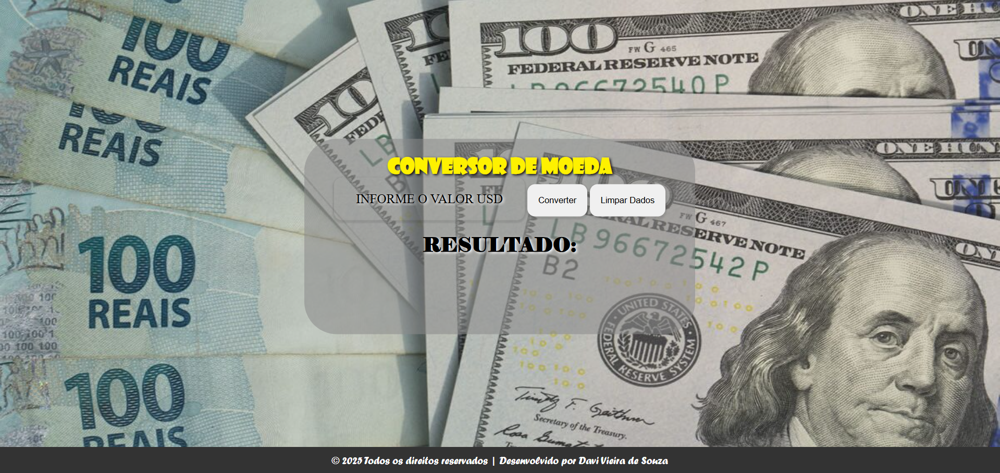

# 💱 Conversor de Moeda (USD → BRL)

Este projeto é um conversor simples de moedas, que utiliza a **ExchangeRate-API** para converter valores de **Dólar Americano (USD)** para **Real Brasileiro (BRL)**.

## 🖥️ Demonstração

O usuário insere um valor em dólares e, ao clicar em "Converter", o sistema retorna o valor correspondente em reais, com base na taxa de câmbio atual da API.



---

## 🚀 Tecnologias Utilizadas

- **PHP (puro)** – lógica do conversor e consumo da API
- **HTML5 & CSS3** – estrutura e estilização da interface
- **JavaScript** – funcionalidade de limpar os dados do formulário
- **ExchangeRate-API** – consulta da taxa de câmbio em tempo real

---

## 📁 Estrutura do Projeto

```
conversorMoeda/
├── assets/
│   ├── img/
│   │   └── wallpaper.jpg
│   ├── limparTela.js
│   └── style.css
├── .gitignore
├── apiKey.php
├── index.php
└── readme.md
```

---

## 🔐 Segurança

- A chave da API foi separada no arquivo `apiKey.php` para evitar exposição.
- O `.gitignore` está configurado para não versionar este arquivo sensível.

```php
// apiKey.php
$apiKey = 'SUA_CHAVE_AQUI';
```

---

## ⚙️ Como Rodar Localmente

1. Clone este repositório:
   ```bash
   git clone https://github.com/seu-usuario/conversorMoeda.git
   ```
2. Crie o arquivo `apiKey.php` na raiz do projeto e insira sua chave da [ExchangeRate-API](https://www.exchangerate-api.com/).

3. Inicie um servidor local (por exemplo, usando o PHP embutido):
   ```bash
   php -S localhost:8000
   ```
4. Acesse no navegador:
   ```
   http://localhost:8000
   ```

---

## 🧪 Funcionalidades

- Inserção de valor em USD
- Conversão automática para BRL utilizando taxa atual
- Validação de entrada
- Botão para limpar o campo de entrada
- Interface visual simples e responsiva

---

## 🙋🏻‍♂️ Autor

Desenvolvido por **Davi Vieira de Souza**  
📎 [LinkedIn](linkedin.com/in/davivieiraa) | [GitHub](https://github.com/davivieirasz)